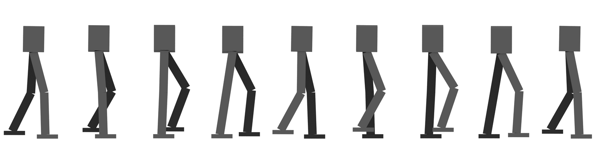

.. title: The eXperimental Robot Project
.. slug: index
.. date: 2014/05/07 19:57:04
.. tags: 
.. link: 
.. description: 
.. type: text

------------
Introduction
------------
The goal of the eXperimental Robot Project (XRP) is to develop an open-hardware humanoid robot. Right now, the focus is on building a bipedal walking machine - arms and hands will follow (much) later. `Read more ... </about.html>`_

----
News
----
.. post-list::
    :stop: 5

`Project Blog <blog/>`_ (`Archives </archive.html>`_, `Tags </categories/index.html>`_, `RSS </rss.xml>`_)

------
Status
------
At this time, the project is in the planning phase. Substantial effort has gone into studying walking in simulation. We are currently building an `acrobot <wiki/Acrobot>`_ to explore the application of optimization-based control to real-world systems. Once that is completed, we will start with the production of actual hardware.

We are physically located at `Dingfabrik <http://www.dingfabrik.de/>`_, a hackerspace in Cologne, Germany. We have access to a reasonably complete electronics lab, a Lasersaur laser cutter, an FDM 3D printer, a Deckel FP2 conventional milling machine, and (soon) a lathe.

We are always looking for contributors! If you have experience in a field relevant to the project and would like to contribute, please do not hesitate to contact us.

-------
Contact
-------
We can be contacted at contact@xrpbot.org. There is currently no public (or, indeed, private) mailing list; however, one will be set up once that makes sense.

